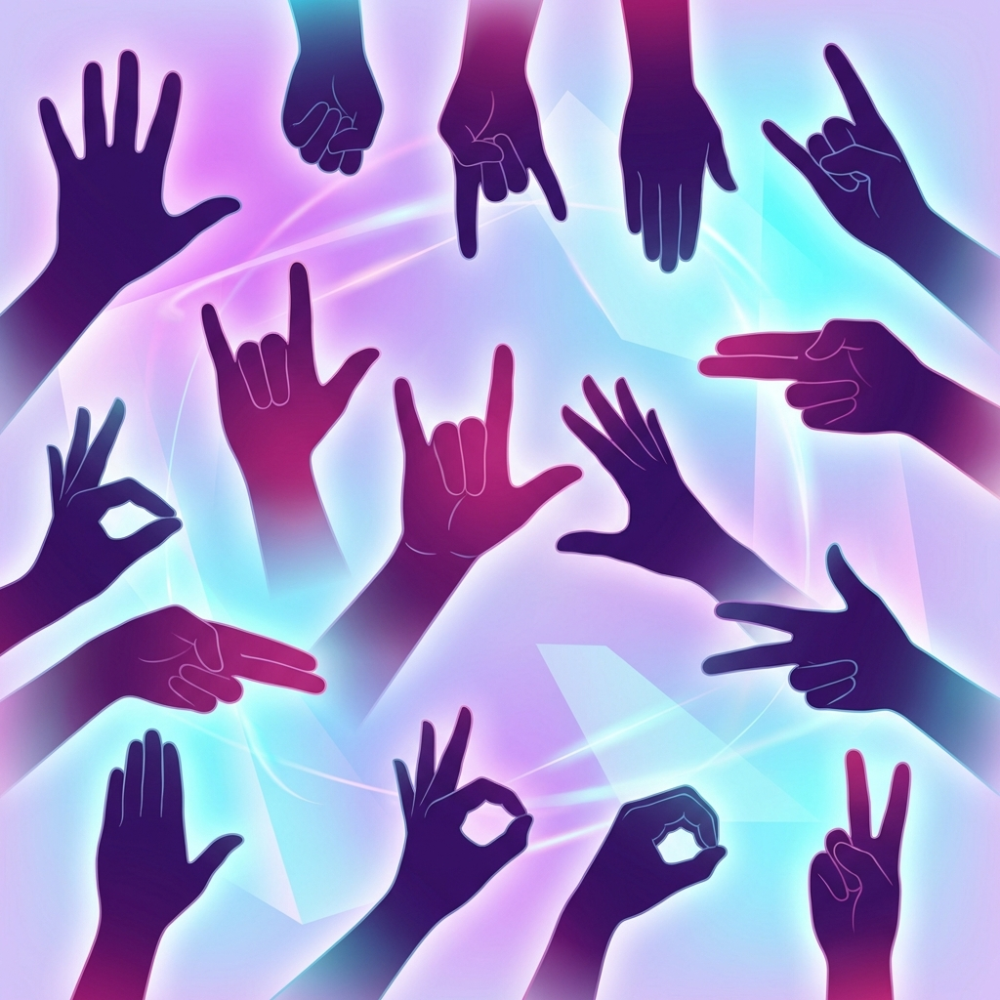

# Sign Bridge 🤟

**Real-time Sign Language Translation Platform**

A modern video meeting application designed specifically for Indian Sign Language (ISL) translation, enabling seamless communication between deaf and hearing communities.



## ✨ Features

### Lobby Page
- 🎨 Beautiful purple gradient design with ISL-themed background
- 🆔 Auto-generated unique user IDs
- 🔐 Secure 6-character meeting codes
- ✅ Real-time service status indicator

### Meeting Interface
- 📹 Real-time video conferencing using WebRTC
- 🎤 Microphone mute/unmute controls
- 📷 Camera on/off toggle
- 🖥️ Screen sharing capability
- 👥 Clean 2-column video grid layout
- 🎯 Professional control interface

## 🚀 Getting Started

### Prerequisites
- Node.js (v16 or higher)
- npm or yarn

### Installation

1. Clone the repository:
```bash
git clone https://github.com/arjun143327/Sign-Bridge.git
cd Sign-Bridge
```

2. Install dependencies:
```bash
npm install
```

3. Start the development server:
```bash
npm run dev
```

4. Open your browser and navigate to:
```
http://localhost:5173
```

## 🛠️ Technologies Used

- **React 18.2** - Modern UI framework
- **Vite 5** - Lightning-fast build tool
- **WebRTC** - Real-time peer-to-peer communication
- **CSS3** - Advanced styling with glassmorphism and gradients

## 📁 Project Structure

```
Sign-Bridge/
├── public/
│   └── isl-background.png       # ISL-themed background
├── src/
│   ├── components/
│   │   ├── Lobby.jsx           # Meeting lobby component
│   │   ├── Lobby.css           # Lobby styling
│   │   ├── Meeting.jsx         # Video meeting interface
│   │   └── Meeting.css         # Meeting styling
│   ├── App.jsx                 # Main application logic
│   ├── App.css                 # App-level styles
│   ├── main.jsx                # React entry point
│   └── index.css               # Global styles
├── index.html                  # HTML entry point
├── package.json                # Dependencies
└── vite.config.js              # Vite configuration
```

## 🎯 How It Works

1. **Join a Meeting**: Enter a 6-character meeting code on the lobby page
2. **Video Call**: Connect with others using real-time video
3. **Controls**: Manage your camera, microphone, and screen sharing
4. **End Call**: Leave the meeting anytime

## 🌟 Key Highlights

- **Accessibility-First Design**: Built specifically for ISL communication
- **Modern UI/UX**: Glassmorphic design with smooth animations
- **Real-Time Communication**: WebRTC for low-latency video streaming
- **Responsive Layout**: Works seamlessly across devices

## 📝 License

ISC

## 👨‍💻 Author

**Arjun**
- GitHub: [@arjun143327](https://github.com/arjun143327)

## 🤝 Contributing

Contributions, issues, and feature requests are welcome!

---

*Built with ❤️ for the deaf and hard-of-hearing community*
